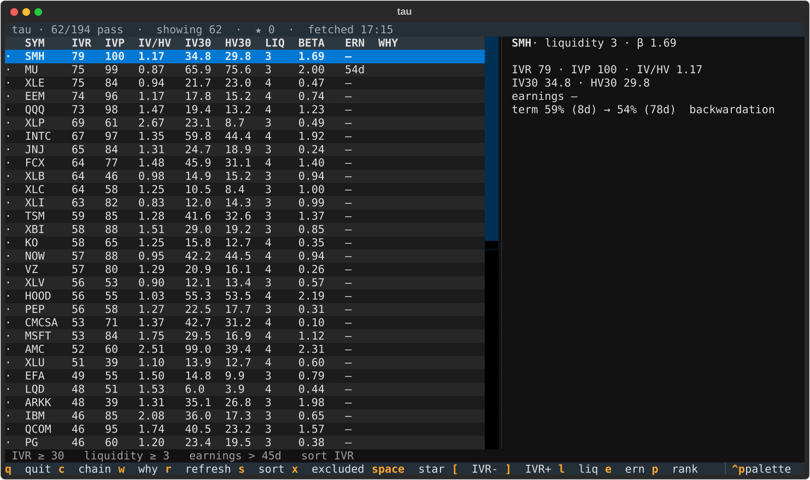
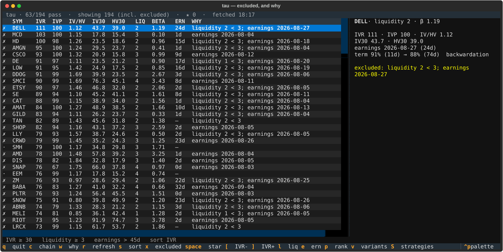
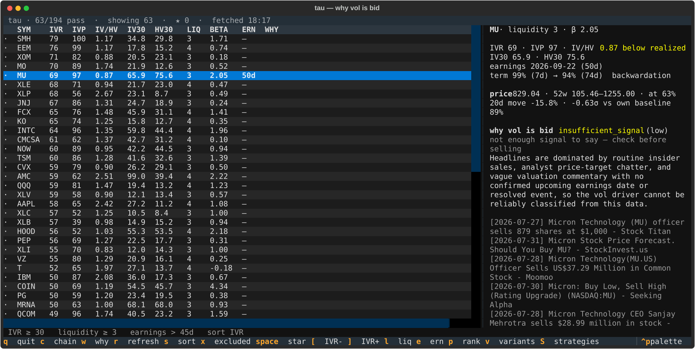
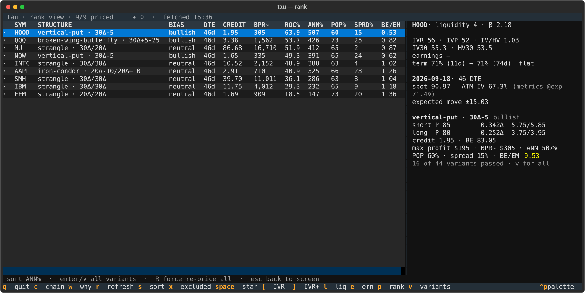
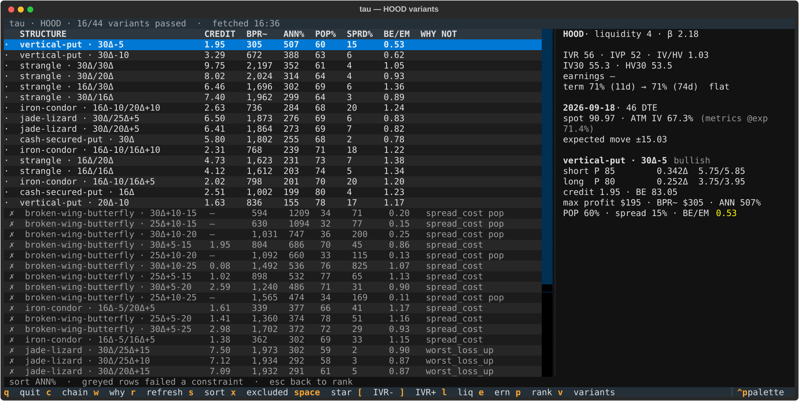
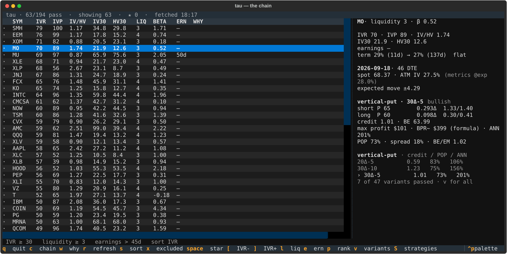

# Using tau

The [README](../README.md) covers installation and the design. This is the
working guide: how a session actually goes, what every number means, and where
each one will mislead you if you read it the obvious way.

- [A session](#a-session)
- [Reading the screen](#reading-the-screen)
- [Reading a structure](#reading-a-structure)
- [Reading a rejection](#reading-a-rejection)
- [Defining your own structure](#defining-your-own-structure)
- [The scan log](#the-scan-log)
- [What tau will not tell you](#what-tau-will-not-tell-you)

---

## A session

The loop is: find where vol is expensive, ask why it is expensive, price what
survives, then look at what got rejected before deciding.

```bash
source .venv/bin/activate
tau
```

### 1. The screen — where is vol rich?

One metrics pull covers the whole universe, and every filter after that is
in-memory. Moving a threshold costs nothing, so move them.



`[` and `]` move the IV rank floor, `l` cycles the liquidity floor, `e` cycles
the earnings exclusion window, `s` re-sorts.

**Sort by `IV/HV` at least once.** IV rank says vol is rich against this
name's own history. IV/HV says vol is rich against what the name actually
does. They disagree more often than you would expect, and a name that passes
the rank filter while pricing options *below* realized vol is not a premium
sale — you would be selling something for less than it has been costing.
Below 1.00 the column turns yellow.

`x` shows everything the screen dropped, with the reason:



Worth checking whenever the pass list looks thin. A filter that is too tight
is visible here rather than silently costing you candidates.

### 2. `w` — why is vol bid?

High IV rank is never free. The question is whether you are being paid for
risk you understand or for a coin flip you have not noticed.



Price context comes first: where the name sits in its 52-week range, and how
far its recent move sits outside its *own* normal. That z-score is measured
against a baseline that deliberately excludes the move being measured — a
violent break inflates trailing volatility, and dividing by a denominator the
move just widened is how a genuine 20-sigma break reports as calm.

Then the catalyst read, if an Anthropic key is configured: `pending_binary`,
`resolved`, `no_idiosyncratic`, or `insufficient_signal`.

**The last two are the pair to be careful with.** `no_idiosyncratic` asserts
a finding — a diversified sector ETF genuinely has no single-name binary.
`insufficient_signal` asserts nothing at all. A false all-clear is the most
expensive output this thing can produce, so it is biased toward saying "not
sure", and an unreadable name is never treated as clear.

This is triage, not clearance. There is no measured accuracy behind it.

### 3. `p` — price the shortlist

Prices the current pass set concurrently, one chain fetch per symbol, and
shows the best structure found on each.



Sort with `s` between annualized return, return on capital, probability of
profit, spread cost, and symbol. Sorting reorders the list; it does not
re-pick the trades. "The best trade on this name" has one definition —
highest annualized return among the variants that passed — and sorting by
probability is a lens on the list rather than a different answer.

### 4. `enter` or `v` — what got rejected

This is the view that makes the rest trustworthy.



Every variant of every strategy on that name, ranked, with the rejected ones
greyed and naming the constraint they broke.

Read the QQQ example above. 28 of 56 variants passed. The four broken wings at
the bottom show **1808%, 1758%, 1027% and 979% annualized** — several times
anything that passed. They were rejected because crossing their legs costs
205%, 224%, 68% and 72% of the premium at stake. Those are not trades. They
are an artifact of dividing a real maximum profit by a tiny buying-power
figure, and without this view they would sit at the top of your ranking
looking like the best opportunities of the day.

That is what the `spread_cost` constraint is for, and it is why the rejected
rows stay on screen instead of vanishing.

---

## Reading the screen

| Column | What it is | Where it misleads |
|---|---|---|
| `IVR` | IV rank, 0–100, against this name's own trailing year | Says nothing about whether vol is rich versus what the name *does* |
| `IVP` | IV percentile — share of days spent below today's vol | High IVR with low IVP means one spike, not a sustained regime |
| `IV/HV` | Implied over realized | Below 1.00 you are selling vol below what the name has actually delivered |
| `IV30` | 30-day implied vol, percent | Fixed 30-day tenor — not the tenor you are trading |
| `HV30` | 30-day realized vol, percent | Backward-looking by construction |
| `LIQ` | tastytrade liquidity rating, 4 best | Symbol-level, **not** strike-specific — a liquid name can have an illiquid wing |
| `BETA` | Beta to the broad market | Ignore for single-name premium selling; it is a portfolio number |
| `ERN` | Days to the next expected report | Often still points at the *just-passed* report until the next is announced, so past dates are ignored |

The detail pane adds term structure — near versus far implied vol, labelled
contango, backwardation, or flat, with the front week excluded because it is
the noisiest point on the curve.

---

## Reading a structure



The header is the cycle: expiration, days to expiration, spot, at-the-money
implied vol, and the expected move.

**At-the-money IV is compared against `metrics @exp`, not against IV30.** IV30
is pinned to a fixed 30-day tenor while the cycle you are trading usually is
not, and on a sloped term structure that mismatch alone produces a 20-point
gap that looks like a pricing bug and is not. Compared at the matching
expiration the residual gap is a consistent 2 to 7 points — mid-based marks
running modestly below tastytrade's own model IV.

**Expected move follows tastytrade's convention**, not the textbook
`S·σ·√t`: the at-the-money straddle blended with the first and second
out-of-the-money strangles, weighted 60/30/10. A single-strike straddle only
samples the smile at one point. When the wing strikes are not both priced it
falls back to `straddle × 0.85` and says so.

Then the structure itself, leg by leg — side, quantity if not one, type,
strike, actual delta, and the bid/ask you would be crossing.

| Figure | What it is | Where it misleads |
|---|---|---|
| `credit` | Net premium **per share** | A debit structure shows `debit` in yellow instead; do not read it as a credit |
| `BE` | Every breakeven, from the payoff function | A broken wing has four; a cash-secured put has one |
| `max profit` | Best case **in dollars per contract** | `∞` when the upside is open. Note the unit change from `credit` |
| `BPR~` | Estimated buying power, dollars | **A formula, not a broker quote.** See the warning below |
| `ANN` | Annualized return on capital | Makes a 40-day trade comparable to a 60-day one. It is *not* a promise of repeating it eight times |
| `POP` | Probability of profit at expiry | Driftless lognormal. Thin tails; real equities gap |
| `spread` | Cost of crossing every leg, as a share of the premium at stake | The single most useful number here, and the one most often ignored |
| `BE/EM` | Nearest breakeven, measured in expected moves | **Under 1.00 turns yellow**: a single standard deviation reaches your breakeven |

Two things about the return figure specifically.

It is `max_profit / bpr`, not `credit / bpr`. On a broken wing the best case
sits at a strike well above the credit taken in, and the structure can price
as a debit, where credit-over-capital is meaningless.

And **buying power is an estimate** from the standard naked-margin formula.
The read-only OAuth grant cannot dry-run an order, so nothing here has been
confirmed by a broker. It reduces correctly to the naked formula on a strangle
and to width-minus-credit on a condor, but every return figure on this screen
divides by it. Check it against your own broker the first time you trade a
new structure family — condors and broken wings especially, since they rank
highest on it.

---

## Reading a rejection

Greyed rows failed. The `WHY NOT` column names the constraint; the detail pane
gives the numbers for whichever row is highlighted.

| Reason | What happened | What it usually means |
|---|---|---|
| `spread_cost` | Crossing the legs costs more than 25% of the premium at stake | A real market condition. Four legs on a thin chain is often simply not tradable |
| `pop` | Probability of profit under 50% | Only on broken wings. A structure more likely to lose than win is not a premium sale, whatever its return figure says |
| `worst_loss_up` | Credit does not cover the call spread's width | Only on jade lizards, and it is the definition rather than a filter. What got built is a lopsided condor, not a lizard |
| `not built` | No legs to price | See below |

A variant that could not be built at all shows `not built`, with the reason in
the detail pane. The two you will see:

**"ladder too coarse"** — a referenced wing landed more than 25% away from the
width it asked for. A 10-wide spread that resolves to 7 wide is a different
trade with different margin and a different maximum loss, so tau refuses it
rather than returning it under the requested label. On a name with genuine
10-point strikes, every 5-wide request is correctly refused. That is the
market, not a bug.

**"two legs resolved to the same contract"** — the requested strikes collapsed
onto one strike. Variants that resolve to identical contracts are also merged
into one row, keeping whichever asked closest to what it got, so you never see
one trade presented twice with two different widths claimed.

---

## Defining your own structure

Definitions live in `src/tau/strategies/`, one module per structure, and ship
inside the package on purpose — what tau searched for is worth being visible.
They are Python rather than a config format because the schema *is* the
dataclass: your editor autocompletes the fields, and a typo'd metric name in a
constraint is a type error before tau ever runs.

```python
# src/tau/strategies/my_structure.py
from tau.payoff import OptionType, Side
from tau.strategy import Bias, Delta, LegSpec, Ref, Require, Strategy
from tau.strategies.defaults import MAX_SPREAD_COST

C, P = OptionType.CALL, OptionType.PUT
LONG, SHORT = Side.LONG, Side.SHORT

MY_STRUCTURE = Strategy(
    name="my-structure",
    bias=Bias.BULLISH,
    legs=[
        LegSpec("short_put", type=P, side=SHORT, strike=Delta([0.20, 0.30])),
        LegSpec("long_put",  type=P, side=LONG,
                strike=Ref("short_put", offset=[-5, -10])),
    ],
    require=[Require("spread_cost", "<=", MAX_SPREAD_COST)],
)
```

Then register it in `src/tau/strategies/__init__.py` by adding it to `ALL`.
Importing that module validates every definition, so a malformed one fails at
import rather than mid-scan.

### Placing a strike

| Selector | Meaning |
|---|---|
| `Delta(0.16)` | Nearest available strike by absolute delta |
| `Moneyness(-0.05)` | 5% below spot |
| `Atm()` | Nearest strike to spot |
| `Ref("short_put", offset=-5)` | Five **dollars** down the ladder from another leg |
| `Ref("short_put", strikes=-2)` | Two **ladder positions** down |

`offset` and `strikes` are different things on an irregular ladder, which is
why both exist. References resolve in declaration order — a forward reference
is a load-time error.

**Any value may be a list, which turns a point into a search.** A scalar is
just a one-element search, so there is one code path. The example above is
four variants: two deltas times two widths. For a broken wing the widths *are*
the trade, and which one pays depends on today's skew, so searching them is
the honest thing to do rather than pinning one.

The cap is 64 variants per strategy, and exceeding it fails loudly at import
rather than silently truncating your search.

### Constraining the outcome

`Require(metric, op, value)`, where `op` is one of `<`, `<=`, `>`, `>=`, `==`
and `value` is a number or another metric name. No arithmetic, no function
calls — the payoff engine already exposes everything a structure's defining
property needs.

Available metrics: `credit`, `net_premium`, `max_profit`, `max_loss`,
`worst_loss_up`, `worst_loss_down`, `bpr`, `roc`, `annualized_roc`, `pop`,
`spread_cost`, `dte`, `breakeven_low`, `breakeven_high`, `be_over_em`,
`worst_off_target`, `leg_count`.

**Ship a `spread_cost` constraint on everything.** A four-legger crosses four
markets, and ranked on return alone it will win on fills that never happen —
see the QQQ example above, where four rejected broken wings all beat every
passing structure on paper.

**Constrain the property, not the shape.** A jade lizard is not "short put
plus call credit spread" — it is that *plus* the credit covering the call
spread's width, so there is no upside risk at all. That is a pricing outcome,
and on a given day the requested deltas may simply not produce it.
`Require("worst_loss_up", "<=", 0)` says so directly. A definition that
treated the leg list as the definition would label non-lizards as lizards.

### Checking it

```bash
tau strategies              # does it parse, and how many variants?
tau variants SPY            # what does it build on a dense ladder?
tau variants MU             # and on a coarse one?
pytest
```

Run it against both a densely struck name and a coarse one. Most definition
bugs show up as "ladder too coarse" on one and not the other.

One trap worth naming, because it shipped: **overlapping offset ladders let
the search build a structure that is not the one you named.** A broken wing
with `near [5, 10]` and `far [-10, -15]` can produce a *balanced* 10/10 fly
and call it broken. That variant priced as a debit with a tiny buying-power
figure and topped the SPY ranking at 11,049% annualized on a 17.9% chance of
profit. Make the ladders strictly non-overlapping.

---

## The scan log

Off by default. `tau` writes nothing to disk unless you ask.

```bash
tau scan --log              # the screen only
tau rank --top 8 --log      # the screen plus the trades
```

SQLite at `~/.local/share/tau/tau.sqlite3`, or wherever `TAU_DATA_DIR` points.

`tau rank --log` writes a `pick` row per symbol: the strategy, the variant,
every leg with its OCC symbol and delta, and all the figures. Definitions are
stored once each in `strategy_def`, keyed by a digest of their serialized
form, so **editing a strategy does not rewrite the history of trades chosen
under the old version** — both coexist under the same name, told apart by
digest. That is what makes "how did 16-delta strangles do against 30-delta
jade lizards" answerable later.

A symbol that priced nothing still gets a row, carrying its reason. An absent
row would be indistinguishable from never having looked.

```sql
SELECT d.name, k.variant, count(*), round(avg(k.annualized_roc), 2)
FROM pick k JOIN strategy_def d ON d.id = k.strategy_def_id
GROUP BY d.digest, k.variant ORDER BY 3 DESC;
```

Nothing reads this yet, and there is no outcome side — you would have to
record fills and results yourself. The log is the input to a scoreboard that
does not exist.

---

## What tau will not tell you

- **Whether the buying power is right.** It is a formula. No broker has
  confirmed it, and every return figure divides by it.
- **Whether the catalyst read is right.** One model call over recent
  headlines, with no measured accuracy. Triage, not clearance.
- **Ex-dividend dates.** An ex-div inside your trade window is real early
  assignment risk on a short call, and nothing here will warn you.
- **Whether you are already short this name.** No position awareness, so
  nothing flags concentration.
- **Anything about weeklies.** Monthly expirations only. A symbol with no
  monthly near your target simply has no usable cycle.
- **Anything about calendars or diagonals.** Payoff-at-expiry is intrinsic
  arithmetic, and a back leg still holding extrinsic value needs a pricing
  model instead.
- **When to close.** tau finds entries. It has no view on management.

And the standing caveat: probability of profit assumes a driftless lognormal.
Real equities gap, tails are fatter than the model, and short premium is
exactly the position that gets hurt when they do. Treat it as a way to compare
proposals, not as a forecast.

Selling options carries unlimited or substantially uncapped risk. Nothing here
is financial advice.
