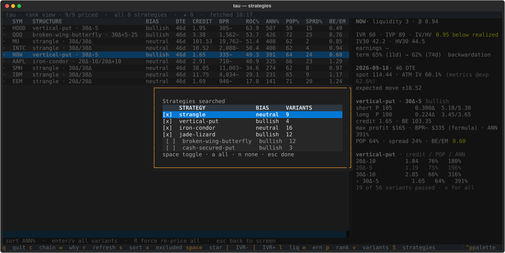

# User guide

This covers the commands, the keyboard shortcuts, what the numbers mean, and
how to define your own structure. If you have not set up credentials yet, start
with [SETUP.md](SETUP.md).

- [Commands](#commands)
- [TUI keys](#tui-keys)
- [The screen](#the-screen)
- [A priced structure](#a-priced-structure)
- [Rejections](#rejections)
- [Defining your own structure](#defining-your-own-structure)
- [Reference](#reference)
- [The scan log](#the-scan-log)

## Commands

```bash
tau                           # interactive TUI
tau tui                       # same, explicit

tau scan                      # the vol screen, text output
tau strategies                # the structures currently defined
tau rank --top 8              # best structure per name
tau variants SPY              # one name's whole search, rejections included
```

`tau scan` — `--min-ivr` (default 30), `--min-liquidity` (1–4, default 3),
`--days` (earnings exclusion window, default 45; 0 disables), `--top N`,
`--all` (every symbol with exclusion reasons), `--universe PATH`, `--log`.

`tau rank` — the same screen filters, plus `--strategy NAME` (repeatable,
defaults to all), `--dte` (default 45), `--min-pop` (probability-of-profit
floor to be eligible as best, default 68%), `--top N` (default 15, since each
row costs a chain fetch), `--log`.

`tau variants SYMBOL` — `--strategy NAME` (repeatable), `--dte`, `--min-pop`,
`--sort METRIC`.

An unknown `--strategy` is an error rather than an empty result.

## TUI keys

One metrics pull feeds every view. Filtering and sorting happen in memory.

| Key | Action |
|---|---|
| `[` / `]` | move the IV rank floor down / up |
| `l` | cycle the liquidity filter |
| `e` | cycle the earnings filter |
| `s` | re-sort |
| `x` | toggle the excluded view, with reasons |
| `c` / Enter | price the highlighted name, show the best structure |
| `w` | price context and catalyst read for the highlighted name |
| `p` | price the whole shortlist, switch to the rank view |
| `v` / Enter | every variant considered on the highlighted name |
| `S` | choose which strategies to search |
| `R` | force a re-price (rank view) |
| `space` | star a name (session only) |
| `r` | refresh from the API |
| `esc` | back one view |
| `q` | quit |

Results are cached per symbol, so leaving a view and coming back is instant.
Only `r` and `R` go back to the API. A name you looked at with `c` has already
been searched in full, so ranking it later costs nothing extra.

### Turning strategies on and off

`S` opens a picker for the strategies the views search over. Space toggles the
highlighted one, `a` turns everything back on, `n` isolates the highlighted one
by itself, and `esc` closes.



This is a filter over results rather than over work. Every name is always
searched against every strategy, so turning one off simply re-ranks what is
already in memory, and turning it back on costs nothing. Nothing is refetched
either way, and the setting survives a refresh with `r`.

The meta line at the top says how many strategies are active whenever some are
off, so a short list is never mistaken for a thin market.

You cannot turn all of them off. The last one stays on, because an empty rank
view looks like a broken scan rather than a filter you set a moment ago.

## The screen


| Column | Meaning |
|---|---|
| `IVR` | IV rank, 0–100, against the name's own trailing year |
| `IVP` | IV percentile, the share of days spent below today's vol |
| `IV/HV` | Implied over realized. Below 1.00 you are selling vol below what the name has delivered, and the column turns yellow |
| `IV30` | 30-day implied vol, percent. A fixed tenor, not the one you are trading |
| `HV30` | 30-day realized vol, percent |
| `LIQ` | tastytrade liquidity rating, 4 best. Symbol-level, not strike-specific |
| `BETA` | Beta to the broad market |
| `ERN` | Days to the next expected report |

`x` shows what was dropped and why, which is worth checking when the pass list
looks thin.


`w` adds price context and a catalyst read: where the name sits in its 52-week
range, how far its recent move sits outside its own normal, and a
classification of why vol is bid — `pending_binary`, `resolved`,
`no_idiosyncratic` or `insufficient_signal`.


Be careful with the last two. `no_idiosyncratic` means the model looked and
found nothing specific to this name. `insufficient_signal` means it could not
tell either way, and it leans toward saying that rather than giving a false
all-clear. Either way this is a starting point for your own checking, not a
verdict. The classification needs an Anthropic API key and a model call that
goes through. When either is missing — no key, no credit, a rate limit, an
unreadable answer — you still get the headlines, with `insufficient_signal` and
a short reason such as `out of API credit — headlines only` where the verdict
would be.

## A priced structure


The header gives expiration, days to expiration, spot, at-the-money implied vol
and the expected move.

At-the-money IV is compared against `metrics @exp`, the term IV at the same
expiration, rather than IV30. IV30 is pinned to 30 days while the cycle usually
is not, and on a sloped term structure that mismatch alone shows a large gap.

Expected move follows tastytrade's convention: the ATM straddle blended with
the first and second OTM strangles, weighted 60/30/10. It falls back to
`straddle × 0.85` when the wing strikes are not both priced, and says so.

| Figure | Meaning |
|---|---|
| `credit` | Net premium per share. A debit structure shows `debit` in yellow instead |
| `BE` | Every breakeven. A broken wing has four; a cash-secured put has one |
| `max profit` | Best case in dollars per contract. `∞` when the upside is open |
| `BPR` | Buying power in dollars: the broker's own dry-run figure when the account answered, otherwise a formula estimate. The `~` suffix on the tables' values marks the estimate; the detail pane spells it out |
| `ANN` | Annualized return on capital, which makes a 40-day trade comparable to a 60-day one |
| `POP` | Probability of profit at expiry under a driftless lognormal, with each breakeven priced under the vol local to it — puts below, calls above. An approximation, not a smile-consistent density; see `payoff.pop_over_intervals` |
| `spread` | Cost of crossing every leg, as a share of the premium at stake |
| `BE/EM` | Nearest breakeven measured in expected moves. Under 1.00 turns yellow |

Return is `max_profit / bpr`, not `credit / bpr`. On a broken wing the best case
sits at a strike above the credit, and the structure can price as a debit.

### Where the buying-power figure comes from

`BPR` is the broker's own number when tau can get it: for each symbol, the
top-ranked structures are sent to your account's order **dry-run** endpoint —
one POST per structure, a calculation preview that places, modifies, and
cancels nothing — and the broker's isolated margin requirement replaces the
in-house estimate. The real number matters because the formula is a standard
naked-margin model and the account runs on portfolio margin; measured against
the broker's figure on 2026-08-20, the formula was $3,980 where the broker
said $3,651 on an AAPL strangle and $28,335 where it said $37,010 on MU.

When the broker does not answer — read-scoped token, network error, timeout,
rate limit, missing credentials — tau silently falls back to the formula and
screens exactly as it always has. Nothing crashes and nothing changes shape;
the fallback is automatic and there is no toggle. The detail pane and the
rank tables label the source per figure: broker-sourced values are plain,
formula estimates carry a trailing `~` (the tables' column header is `BPR`
for both). `tau rank --top N` prices the top N names; within each name the
top 10 structures get the broker figure.

Because that shortlist is bounded, one name's rows can carry figures from both
models at once. The two are not comparable — the same trade prices 30% apart
between them — so the winning structure is picked within one model: whenever
any candidate has a broker figure, only broker-priced candidates compete, and
a name with none of them ranks exactly as it did before the dry-run existed.
The same rule governs every ordering. `tau rank` sorts symbols against each
other on the broker figures only when every name in the pass got them, and the
variants drill-in sorts a name's ladder on them only when every passing variant
got them — which, since the pull stops at ten, means a name with more than ten
passing variants always orders on the formula. Either way one name missing them
drops the whole list back to the formula, the yardstick every row always has.
Each row still shows and labels its own figure; this decides the sort key, not
the display.

The pull is all or nothing for that reason. Which POSTs come back first is
network timing, so a shortlist priced in part would hand the headline pick to
whichever ones did — the seventh-best structure presented as the trade to do,
with nothing saying the six above it were never priced. Either every candidate
gets a broker figure or the name stays on the formula across the board. Only
tradable structures are priced at all; a variant that failed a constraint keeps
its estimate rather than costing a live call.

Two bounds keep an unavailable broker from stalling a pass. The pull gets 30
seconds per name, and after three dry-run failures in a row tau stops asking —
the case that needs it is an account API that hangs rather than fails, where
nothing would otherwise be cached and every name would pay the wait again.
Running out of those 30 seconds counts as one of the three: a broker slow
enough to burn the deadline did not answer, and the pass stops paying the
stall rather than repeating it name after name. So does failing to read the
account list at all, which gets the same two-minute pause rather than being
taken as a permanent verdict on the token.
That pause lasts two minutes, not the rest of the run: the dry-run endpoint
gives tau no way to tell a rate limit from a real failure, and a session that
runs for hours must not lose broker pricing for good over one rough patch.
When the two minutes are up a single call goes out to find out — if it answers,
pricing resumes; if not, another two minutes. While it is paused the TUI meta
line reads `broker BPR off`, so a screen full of `~` is never ambiguous between
"the broker stopped answering" and "these were always estimates". In the TUI the drill-in never waits on the
broker at all: the variants appear on the estimates immediately and upgrade in
place when it answers.

Underneath the structure you get the rest of that strategy's ladder, with the
winner marked. The rank view can only show one row per name, and on return
alone the widest delta almost always wins, so this is where you see what the
extra credit costs you in probability. On the example above, moving from
16Δ/16Δ to 30Δ/30Δ roughly doubles the credit and takes the chance of profit
from 74% down to 62%.

## Rejections


The greyed rows are the ones that failed. `WHY NOT` names the constraint they
broke, and the detail pane shows the numbers behind whichever row you have
highlighted.

| Reason | Meaning |
|---|---|
| `spread_cost` | Crossing the legs costs more than 25% of the premium at stake |
| `pop` | Probability of profit under the floor, default 68% (`--min-pop`). On every strategy |
| `worst_loss_up` | Credit does not cover the call spread's width. Only on jade lizards |
| `not built` | No legs to price, with the reason in the detail pane |

There are three reasons a variant cannot be built at all.

**ladder too coarse** — a referenced wing landed more than 25% away from the
width it asked for. A 10-wide spread that resolves to 7 wide has different
margin and a different maximum loss, so tau refuses it rather than returning it
under the requested label. On a name with 10-point strikes, every 5-wide
request is correctly refused.

**no strike near that delta** — the same rule on the other selector. The
nearest quoted contract missed the requested delta by more than 0.05, so a
`16Δ` variant would have been holding something materially different, with a
different probability of profit. This is what a partially quoted chain looks
like: the far wings are the contracts with no resting market, so they are the
ones that fail to quote, and the nearest survivor can be most of the way to the
money. Expect it on thin names, and expect it to leave some of them with no row
at all — `tau rank` closes with a count of how many names produced a structure
so that none is legible as a result rather than as a blank screen.

**two legs resolved to the same contract** — the requested strikes collapsed
onto one strike. Variants resolving to identical contracts are also merged into
one row, keeping whichever asked closest to what it got.

In the screenshot above, the rejected broken wings show far higher annualized
returns than anything that passed, and cost 68% to 224% of the premium to
cross. That is what the `spread_cost` constraint is for.

## Defining your own structure

Each structure lives in its own module under `src/tau/strategies/`, and you
register it by adding it to `ALL` in `__init__.py`. Every definition is
validated on import, so a broken one fails immediately instead of halfway
through a scan.

```python
from tau.payoff import OptionType, Side
from tau.strategy import Bias, Delta, LegSpec, Ref, Require, Strategy
from tau.strategies.defaults import MAX_SPREAD_COST, MIN_POP

C, P = OptionType.CALL, OptionType.PUT
LONG, SHORT = Side.LONG, Side.SHORT

MY_STRUCTURE = Strategy(
    name="my-structure",
    bias=Bias.BULLISH,
    legs=[
        LegSpec("short_put", type=P, side=SHORT, strike=Delta([0.20, 0.30])),
        LegSpec("long_put",  type=P, side=LONG,
                strike=Ref("short_put", offset=[-5, -10])),
    ],
    require=[
        Require("spread_cost", "<=", MAX_SPREAD_COST),
        Require("pop", ">=", MIN_POP),
    ],
)
```

### Selectors

| Selector | Meaning |
|---|---|
| `Delta(0.16)` | Nearest strike by absolute delta |
| `Moneyness(-0.05)` | 5% below spot |
| `Atm()` | Nearest strike to spot |
| `Ref("short_put", offset=-5)` | Five dollars down the ladder from another leg |
| `Ref("short_put", strikes=-2)` | Two ladder positions down |

`offset` and `strikes` differ on an irregular ladder, which is why both exist.
References resolve in declaration order; a forward reference is a load-time
error.

Any value may be a list, which makes the definition a search. The example above
is four variants: two deltas by two widths. The cap is 64 variants per
strategy, and exceeding it fails at import.

### Constraints

`Require(metric, op, value)`, where `op` is one of `<`, `<=`, `>`, `>=`, `==`
and `value` is a number or another metric name.

Available metrics: `credit`, `net_premium`, `max_profit`, `max_loss`,
`worst_loss_up`, `worst_loss_down`, `bpr`, `roc`, `annualized_roc`, `pop`,
`spread_cost`, `dte`, `breakeven_low`, `breakeven_high`, `be_over_em`,
`worst_off_target`, `leg_count`.

`bpr`, `roc` and `annualized_roc` can be ranked on but not required, and a
strategy that tries fails at load. Constraints are settled when the structure
is built, off the formula estimate; the broker's dry-run figure arrives after
that and replaces the buying-power number the row displays. A floor decided on
one model and shown against the other is a green row failing its own rule.

Constrain the pricing outcome rather than the shape where you can. A jade
lizard is defined by its credit covering the call spread's width, which is
`Require("worst_loss_up", "<=", 0)`. On a given day the requested deltas may
not produce it.

Ship a `spread_cost` constraint on everything. A four-legger crosses four
markets and will otherwise win the ranking on fills that never happen.

Ship a `pop` constraint on everything too, anchored on `MIN_POP`. Every
delta in a search widens the credit and the return along with it, so
without a probability-of-profit floor the widest variant always wins on
`annualized_roc` alone.

### Checking it

```bash
tau strategies              # does it parse, and how many variants?
tau variants SPY            # a densely struck name
tau variants MU             # a coarse ladder
pytest
```

Most definition bugs only show up on one of the two.

Watch out for overlapping offset ladders, which let the search build something
other than the structure you named. A broken wing with `near [5, 10]` and
`far [-10, -15]` can come out as a balanced 10/10 fly. Keep the two ranges from
overlapping.

## Reference

Scan parameters are constants rather than flags:

| Parameter | Value | Constant |
|---|---|---|
| Target days to expiration | 45 (`--dte` overrides) | `chain.TARGET_DTE` |
| Expirations | monthlies only | `chain.MONTHLY_EXPIRATION_TYPE` |
| Strike window | ±2.5σ, max 80 per side, nearest 60 contiguous | `chain.SIGMA_SPAN`, `MAX_STRIKES_PER_SIDE`, `UNSTRIDED_CORE` |
| Max spread cost | 25% of premium at stake | `strategies.defaults.MAX_SPREAD_COST` |
| Min probability of profit | 68% (`--min-pop` overrides) | `strategies.defaults.MIN_POP` |
| Max referenced-strike miss | 25% of the requested width | `build.MAX_REF_MISS` |
| Max delta-selected miss | 0.05 delta | `build.MAX_DELTA_MISS` |
| Max variants per strategy | 64 | `strategy.MAX_VARIANTS` |
| Margin estimate | max(20% spot − OTM + premium, 10% strike + premium, $50) per contract | `payoff.OTM_PERCENT`, `STRIKE_PERCENT`, `MIN_PER_CONTRACT` |

Buying power is the broker's isolated margin requirement from the order
**dry-run** when the account answers (see [Where the buying-power figure
comes from](#where-the-buying-power-figure-comes-from)); the formula row above
is the always-available fallback.

Because only monthlies are considered, a symbol with no monthly expiration near
the target DTE simply has no usable cycle. It will not quietly fall back to a
weekly.

Probability of profit assumes a driftless lognormal, with each boundary of a
profitable interval priced under the implied volatility local to it:

$$\sigma_\tau(K, s) = \sigma(K, s)\sqrt{\tau}, \quad \tau = \text{DTE}/365$$

$$d(K, s) = \frac{\ln(K/S) + \sigma_\tau(K, s)^{2}/2}{\sigma_\tau(K, s)}$$

$$P(\text{profit}) = \sum_{\text{profitable } (a,b)} N\big(d(b, \text{call})\big) - N\big(d(a, \text{put})\big)$$

S is spot and N is the standard normal CDF. σ(K, s) is the implied volatility
quoted on side s of the chain at price K: the put side for the lower breakeven
a, the call side for the upper breakeven b. It is linear in strike between the
two bracketing quoted strikes and flat outside the quoted range, because the
credit pushes a breakeven off the strike grid almost by construction. That
boundary alone falls back to the chain's at-the-money implied volatility when,
and only when, that side of the chain carries no usable IV at any strike — a
partially skewed estimate beats none. A gap in the quotes around a breakeven is
interpolated or flat-extrapolated across instead, never escalated to the ATM
read. The intervals come from the payoff function, so one, two or four
breakevens are handled the same way.

Be clear about what that is. Reading a lower boundary off one lognormal and the
upper boundary off another is a practitioner approximation, not a distribution:
the two CDFs subtracted here do not belong to the same random variable, and
nothing constrains the result to be monotone in the skew (a call side quoted
far under ATM can push the number back *up*). It is strictly better than
ATM-for-everything and it is what a desk would do; it is not a correct POP. The
rigorous version recovers the risk-neutral density from the whole smile
(Breeden-Litzenberger across the chain) and is not implemented here.

It uses the breakevens rather than the strikes. Credit pushes the breakevens
past the strikes, so the common `1 − Δ` shortcut understates the real odds.

## The scan log

Logging is off by default.

```bash
tau scan --log              # the screen only
tau rank --top 8 --log      # the screen plus the trades
```

SQLite at `~/.local/share/tau/tau.sqlite3`, or wherever `TAU_DATA_DIR` points.

`tau rank --log` writes a `pick` row per symbol: the strategy, the variant,
every leg with its OCC symbol and delta, and the figures. Definitions are
stored once each in `strategy_def`, keyed by a digest, so editing a strategy
does not rewrite the history of picks made under the old version. A symbol that
priced nothing still gets a row with its reason.

`bpr_source` records which margin model produced that row's `bpr`, and `roc`
and `annualized_roc` with it — `broker` for the dry-run figure, `estimate` for
the formula, `NULL` on rows written before the column existed. Filter on it
before comparing capital efficiency across scans; the two models are different
numbers for the same trade.

```sql
SELECT d.name, k.variant, count(*), round(avg(k.annualized_roc), 2)
FROM pick k JOIN strategy_def d ON d.id = k.strategy_def_id
GROUP BY d.digest, k.variant ORDER BY 3 DESC;
```

Nothing reads this yet and there is no outcome side, so you would have to
record fills and results yourself.
